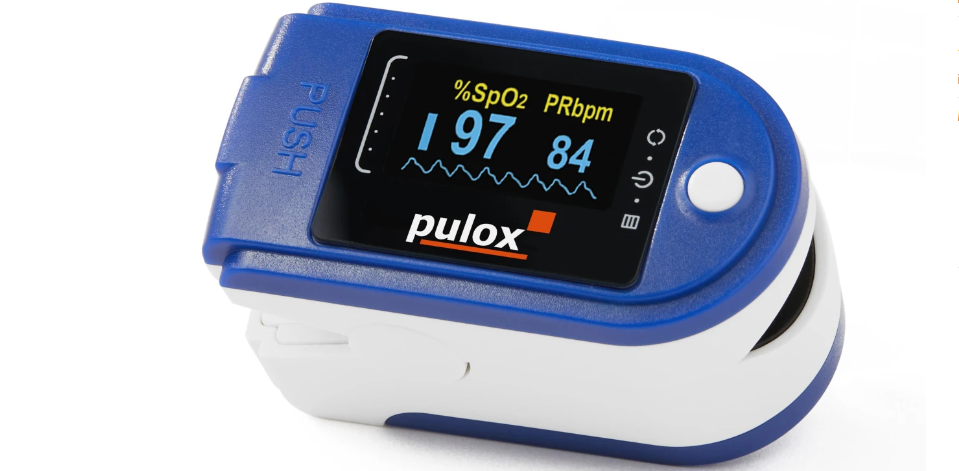
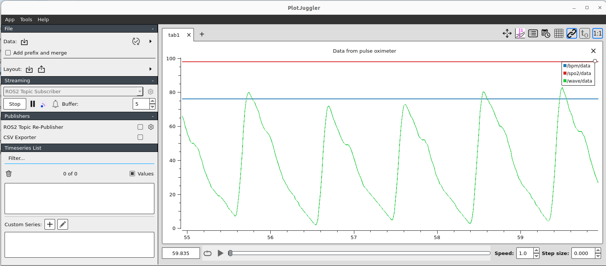

# Python and ROS2 Driver for the pulse oximeter Contec CMS-50D-PLUS / Pulox PO-250
This driver will retrieve BPM, SpO2, and waveform values in realtime via a usb seriallink to a linux host system.
There is a standalone python version as well as a ROS2 Humble node.
The data visualization tool PlotJuggler allows for viewing the live data.

## How to start
Standalone python script (This may also work on Windows)
```bash
# requirements
pip3 install pyserial

# find USB port number
sudo dmesg

# start as python script
sudo python3 cms50dplus.py /dev/ttyUSB0
```
Start in docker container and with ROS2 Humble support
```bash
# build container once
source build_docker.sh

# run container
source start_docker.sh
ros2 launch cms50dplus_ros2_driver driver.launch.py
```

Start PlotJuggler for data visualization
```bash
# attach new shell to container
docker exec -it cms50dplus_ros2_driver bash
# launch plotjuggler
ros2 run plotjuggler plotjuggler
# or with saved layout configuration
ros2 run plotjuggler plotjuggler -n -l ~/ros2_ws/src/cms50dplus_ros2_driver/ros2/config/plotjuggler.xml
```

## Further ressources
- This [documentation](https://www.tranzoa.net/~alex/blog/wp-content/uploads/2018/08/CMS60DWCommunication-protocol-of-pulse-oximeter-V7.0.pdf) seems to be most accurate for the model version I have (not everything matches)
- Inital [repo](https://github.com/titinho11/CMS50E-raw-ppg-data/tree/master) this work is based on 
- related project [repo](https://github.com/MarkMLl/Contec_cms50dplus/tree/main) in Pascal
- this is a very detailed [repo](https://github.com/atbrask/CMS50Dplus/tree/master) for CMS50dplus but apparently also wrong data format
- this is a helpful [article](https://www.atbrask.dk/?p=244), especially the tips in the comments on newer versions



*There are apparently different versions of the cms50e and cms50dplus. Not having found a code allowing me to retrieve the data from the version I had (above picture), I created this one. Moreover, the difference between the versions is often the serial opening baud and the real time raw data exchange protocol. Changing these may work for similar devices*



## Debugging tricks
- If the device is not recognized, maybe [this driver](https://www.silabs.com/products/mcu/pages/usbtouartbridgevcpdrivers.aspx) is not installed in your PC. Check out on the internet if it is the case, and how to install that. But if you have the SPO2 Assistant software provided with the device installed in you PC, and if you can connect the device to that software, you should not have this issue. 
- In Ubuntu, to make sure the device is well plug and recognized, enter `dmesg` in the terminal after plug in the device and look at the output. You should see something like the screen below :

